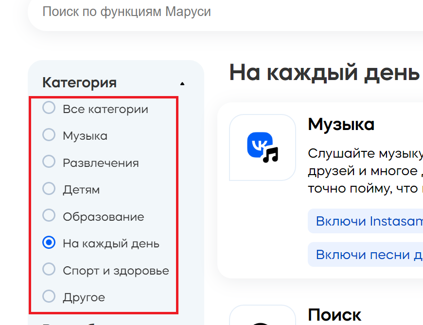
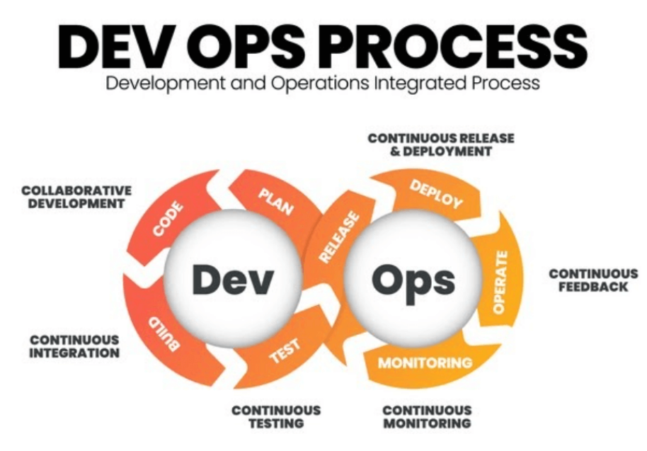
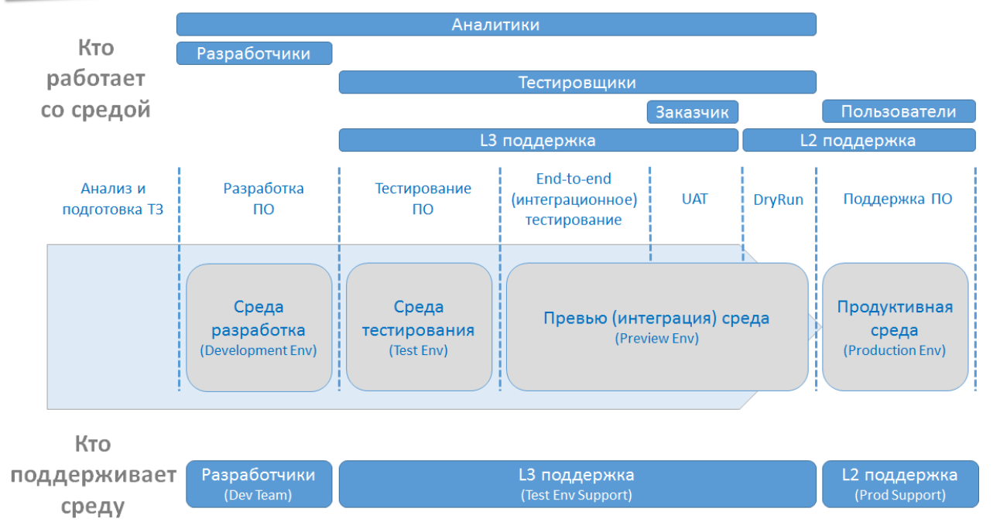
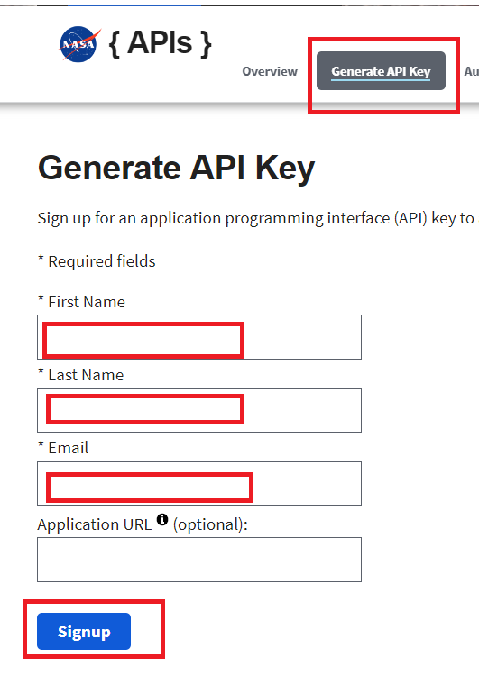
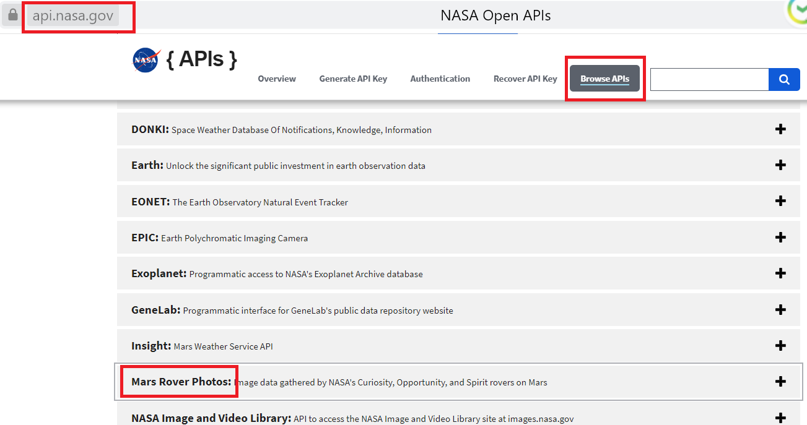
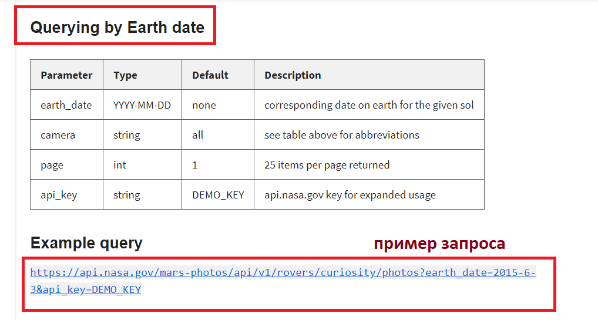
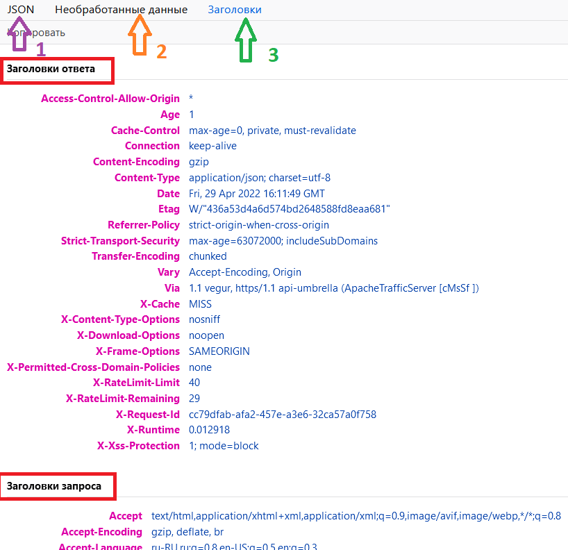
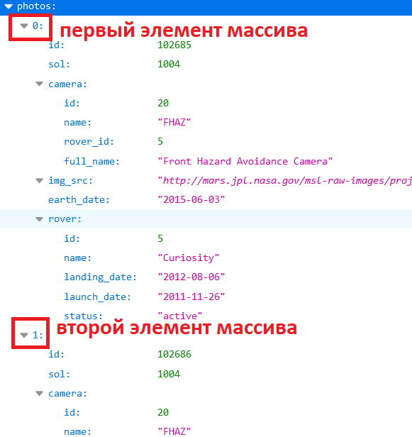
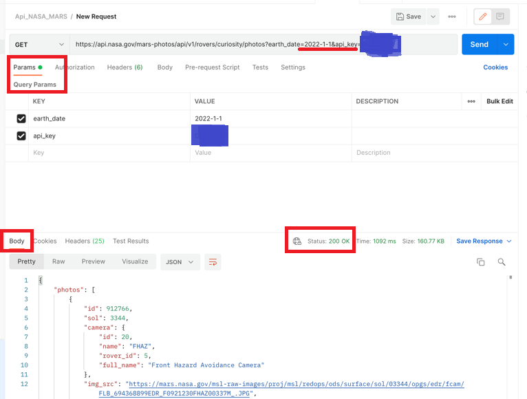

# Проект 9 — Development, DevOps and Database

Тестировщик, как и любой ИТ-инженер, по мере накопления опыта расширяет свои компетенции не только вертикально (junior, middle, senior), но и горизонтально.
Обязательным пунктом развития будет погружение в технологический стек разработки (текущего рабочего проекта) и освоение кросс-компетенции DevOps.
Именно этим вы сейчас и займетесь: развитием навыков, которые в совокупности с навыками, выработанными на предыдущих проектах, складываются в понятие TestOps.

Технологический стек разработки влияет на подход к тестированию.
Рассмотрим как это влияние выражается, и что нужно знать тестировщику для оптимизации работы.
А в заключение вы протестируете API NASA и увидите реальные снимки марсохода.

## Contents

1. [Chapter I](#chapter-i) \
    1.1. [Three Amigos](#three -amigos)
    1.2. [Task 1](#task-three -amigos)
2. [Chapter II](#chapter-ii) \
    2.1. [Avito](#avito)
    2.2. [Task 2](#task-avito)
3. [Chapter III](#chapter-iii) \
    3.1. [VK Voice Assistant](#vk-voice-assistant)
    3.2. [Task 3](#task-vk-voice-assistant)
4. [Chapter IV](#chapter-iv) \
    4.1. [Database](#database)
    4.2. [Task 5](#task-database)
5. [Chapter V](#chapter-vi) \
    5.1. [DevOps](#devops)
    5.2. [Task 6](#task-devops)
6. [Chapter VI](#chapter-vi) \
    6.1. [Test Environment](#test-environment)
    6.2. [Task 6](#task-test-environment)
7. [Chapter VII](#chapter-vii) \
    7.1. [API NASA](#api-nasa)
    7.2. [Task 7](#task-api-nasa)	

## Instructions

*Все созданные файлы и скрины загружать в папку src ветка develop.*  

*Созданные документы могут быть в любом текстовом формате. При выгрузке из Notion лучше выбирать формат PDF.*

*Данные на скриншотах должны быть читаемые и покрывать смысл задания.*  

*Нумерация всех скриншотов начинается с 01. В случае, если содержимое занимает больше одной страницы и требуется сделать несколько скриншотов, добавляйте дополнительную нумерацию в конец названия файла: «…_01», «…_02» и так далее.*

*У каждого должна быть почта для использования в тестовых целях.*

<h2 id="chapter-i" >Chapter I</h2>
<h2 id="three-amigos" >Three Amigos</h2>

Успех проекта во многом зависит от того, выстроена ли свободная и понятная коммуникация между бизнесом, разработкой и тестированием.
С этой задачей прекрасно справляется практика «3 Amigos».

<h3 id="task-three-amigos" >Task 1</h3>

- Создайте документ «Three_amigos». Опишите в нем подход к разработке «Three Amigos», какие роли выделяются для работы и коммуникации, особенности этого подхода;

- в документ «Three_amigos» добавьте задачи и вклад в проект каждого из участников команды разработки в подходе «3 Amigos». Опишите смысл и назначение Acceptance criteria, User Story, DoD (Definition of Done).

<h2 id="chapter-ii" >Chapter II</h2>
<h2 id="avito" >Avito</h2> 

Влияние технологического стека на подход к тестированию заключается в том, что подбор стратегии тестирования основывается на подходе к постановке задачи.
Например: если в компании внедряют API для своей системы, то в STLC добавляется этап API тестирования.

Самые известные подходы к разработке и тестированию:
TDD — Test Driven Development;
BDD — Behaviour Driven Development;
DDD — Domain Driven Design;
FDD — Feature Driven Development;
MDD — Model Driven Development;
KDT — Keyword Driven Testing.

Выбранный подход будет влиять на Testing Stages (этапы тестирования), Test Environment (среды тестирования) и Test Strategy (структуру тестовой модели).

Компания Авито сейчас — это технологическая компания, в которой есть выделенное подразделение AvitoTech.
На портале AvitoTech сотрудники Авито делятся ценностями, бизнес-процессами, стандартами, процедурами и правилами, которые используют в командах.
Ресурс AvitoTech (и подобные ему в других технологических компаниях) можно использовать для изучения сферы ИТ и тестирования в частности, а также для понимания в целом что происходит в плане развития технологий в нашей стране.

<h3 id="task-avito-tech" >Task 2</h3>

- Создайте тестовую модель для тестирования сервиса Авито_Работа (в Notion или TestRail). Тестовая модель должна состоять из двух блоков: тестирование веб-версии и мобильного приложения. В каждом блоке по 20 тест-кейсов: 17 шт. позитивных функциональных тестов и 3 шт. негативных проверок; 
- в каждый тест добавьте предварительный шаг (prerequisite): это условия, которые должны быть выполнены перед началом прохождения тест-кейса. Условия следующие: пользователь должен быть авторизован, у него должно быть актуальное резюме (в случае негативных проверок условием будет отсутствие резюме у пользователя). Поиск вакансий осуществляется по ключевым словам «Инженер по тестированию», «Тестировщик», «QA Engineer»;
- каждый тест должен проверять функционал, связанный с отображением вакансий по заданному поиску;
- загрузите тестовую модель Авито_Работа в документ «Авито_Работа»;
- проведите тестирование веб-версии и мобильного приложения по созданным тест-кейсам;
- по результатам тестирования создайте отчет о тестировании «Avito_Test_Report». В отчете должно содержаться: описание среды тестирования (тип и версия мобильного устройства для мобильного приложения и операционная система, название и версия браузера для веб-приложения), список пройденных тестов, статус прохождения каждого теста, список найденных дефектов (если были найдены). Загрузите отчет о тестировании в проект.

<h2 id="chapter-iii" >Chapter III</h2>
<h2 id="vk-voice-assistant" >VK Voice Assistant</h2>

Компания ВКонтакте является Экосистемой и активно развивает множество проектов. 
Ощутимая часть инфраструктуры VK выложена Павлом Дуровым в OpenSource вместе с документацией.
Для более подробного знакомства с технологическим стеком можно использовать выступления разработчиков этой компаний на конференциях, VK портал для разработчиков.

Компанией ВКонтакте в июне 2019 был представлен голосовой помощник «Маруся», который сейчас активно развивается.

Здесь описание функций Маруси: https://marusia.mail.ru/skills/all.

<h3 id="task-vk-voice-assistant" >Task 3</h3>

- Создайте тестовую модель Marusia_TM для тестирования голосового помощника Маруся (в Notion или TestRail). Выберите две любые функции Маруси и создайте 20 тест-кейсов, по 10 шт. для каждой функции (только позитивные проверки);
- загрузите тестовую модель Marusia_TM в документ «Marusia_TM»;
- проведите тестирование веб-версии голосового помощника по созданным тест-кейсам (для проведения тестирования Марусю нужно будет установить);
- по результатам тестирования создайте отчет о тестировании «Marusia_Test_Report». В отчете должно содержаться: описание среды тестирования (операционная система, название и версия браузера), список пройденных тестов, статус прохождения каждого теста, список найденных дефектов (если были найдены). Загрузите отчет о тестировании в проект.

<h2 id="chapter-iv" >Chapter IV</h2>
<h2 id="database" >Database</h2>

База данных (БД) — это программа, которая позволяет хранить и обрабатывать информацию в структурированном виде.
Работа с БД — это неотъемлемый этап тестирования.
Для базового уровня владения SQL сейчас доступно много хороших бесплатных курсов и онлайн тренажеров (например, https://sql-ex.ru).

<h3 id="task-database" >Task 4</h3>

- Создайте документ «Database». Внесите в него определение и описание базы данных, из чего она состоит. Добавьте описание СУБД и отличия БД и СУБД;
- в документ «Database» добавьте виды баз данных и их описание;
- в документ «Database» добавьте типы баз данных, их особенности и отличия;
- в документ «Database» добавьте блок «SQL», опишите в нем что такое SQL и для чего используют команды SQL. Добавьте описание базовых запросов SQL — CRUD (Create, Read, Update, Delete) и Select;
- в документе «Database» добавьте блок «DB Testing», в нем опишите для чего тестировщик обращается к базе данных.

<h2 id="chapter-v" >Chapter V</h2>
<h2 id="devops" >DevOps</h2>

DevOps — это набор технологий для организации непрерывного процесса поставок — непрерывной интеграции процессов разработки и эксплуатации.  

Конвейер DevOps — это двигатель жизненного цикла разработки ПО.
Он помогает сократить рабочий процесс, упростить коммуникацию между командами, добавить автоматизацию и многое другое.

<h3 id="task-devops" >Task 5</h3>

- Создайте документ «DevOps» и заполните его определением DevOps и какую роль играет тестировщик в процессе непрерывной поставки;
- внесите в документ «DevOps» подробное описание этапов непрерывной поставки CI/CD/CDP и значение этих этапов в процессе создания программного продукта или сервиса;

- внесите в документ «DevOps» описание Quality Gates: что это такое, для чего используются и как они реализуются.

<h2 id="chapter-vi" >Chapter VI</h2>
<h2 id="test-environment" >Test Environment</h2>

Тестовое окружение, тестовый стенд, среда тестирования — все это названия одного понятия: площадки, на которой происходит тестирование.

Для каждого этапа тестирования создается своя тестовая среда.

Конфигурация тестового стенда может состоять из:
- инфраструктуры;
- сервера(ов) для разворачивания нашего приложения;
- самого тестируемого приложения в той версии, которую мы на данном этапе проверяем;
- базы данных;
- сети;
- операционной системы;
- браузера(ов);
- периферийного оборудования (колонки, принтеры, микрофоны и проч.);
- заглушек смежных систем и интеграционных сервисов и проч.

<h3 id="task-test-environment" >Task 6</h3>

- Создайте документ «Test_Environment». Внесите в него что такое тестовая среда и как она формируется;
- в документ «Test_Environment» внесите примеры тестового окружения для тестирования функционала мобильного приложения Avito (что нужно установить на тестовый стенд перед началом тестирования).

Обычно существует разделение сред на среду разработки, тестирования и производственную (рабочую, «боевую»).
Но это минимальный набор сред.
Кроме них также могут выделять, например, превью и интеграционную среду.

- В документ «Test_Environment» внесите описание видов техподдержки (первая линия L1, вторая линия L2, третья линия L3);
- в документ «Test_Environment» внесите для чего нужна каждая из сред и её особенности (Среда разработки — Development Env., Среда тестирования — Test Env. или Stage, Интеграционная среда — Integration Env., Превью среда — Preview/Preprod Env., Производственная среда — Production Env).

<h2 id="chapter-vii" >Chapter VII</h2>
<h2 id="api-nasa" >API NASA</h2>

В заключение проекта 9, а также для подготовки к финальному проекту, проведем еще раз API тестирование в Postman.

На этот раз будем использовать API NASA — ведомства США по аэронавтике и исследованию космического пространства.
У NASA есть публичный API для доступа к фотографиям с марсоходов.

https://api.nasa.gov/

<h3 id="task-api-nasa" >Task 7</h3>

- Зайдите на официальный сайт открытого API NASA https://api.nasa.gov/ и сгенерируйте персональный ключ;

- зайдите в API «Mars Rover Photos». Посмотрите какие есть примеры запросов и параметры для этих запросов;

- возьмите готовый пример запроса «Example query» с отбором по Земной дате «Querying by Earth date» и запустите его в браузере Chrome. Сделайте скрин, назовите его «01.chrome».

- теперь этот же запрос «Example query» с отбором по Земной дате «Querying by Earth date» запустите в браузере Firefox. Сделайте скрин всех трех доступных вкладок (JSON, Необработанные данные, Заголовки), присвойте скринам соответствующие названия: «02.firefox_json», «03.firefox_data», «04.firefox_headers»;

- в этом же запросе во вкладке JSON браузера Firefox обратите внимание на нумерацию элементов массивов в JSON. Это поможет выполнить задание по сохранению переменной;

- зайдите в Postman и создайте коллекцию Api_NASA_MARS;

- в этой коллекции Api_NASA_MARS создайте GET запрос, вставьте в него запрос, с которым вы только что работали в браузере, но изменив дату на 2022-1-1;  

- создайте документ «API_NASA» и внесите в него получившийся запрос. Отправьте этот запрос и сделайте скрин результата запроса, назовите скрин «05.get_api_nasa». На скрине должно быть видно: блок с параметрами, статус запроса и 13 верхних строк body ответа. Личный ключ нужно скрыть (закрасить в любом редакторе).

> Вспоминаем, что переменные бывают на уровне коллекции, на уровне окружения и на уровне запросов.
 
> Те скрипты, которые нужно запускать ДО отправки запроса помещаются в блок «Pre-Request Script»; те скрипты, которые нужно запускать после запроса помещаются в блок «Test»

- Теперь создайте скрипт для того, чтобы из ответа взять 14-ый элемент массива (в массиве Json этот элемент обозначается [13], т.к. нумерация элементов массива в Json файле начинается с нуля), затем из этого элемента сохраните значение его параметра «img_src» в переменную окружения «marsPhotoLink». Сделайте скрин блока Test в Postman GET запроса Api_NASA_MARS, на котором виден созданный скрипт. Присвойте скрину название «06.test_postman»; 

- сделайте запуск GET запроса Api_NASA_MARS (с добавленным скриптом для сохранения переменной);

- скопируйте значение переменной «marsPhotoLink», которое сохранилось в результате запуска GET запроса (у вас должен получиться URL формата: https://mars.nasa.gov......jpg). Вставьте этот URL в адресную строку браузера и нажмите Enter. Должна загрузиться фотография, сделанная марсоходом. Сделайте скрин фотографии, назовите скрин «07.mars_rover»;

- в документ «API_NASA» внесите полученный URL;

- в документ «API_NASA» внесите описание запроса (из чего состоит), что такое GET, https, URI, что значит знак «?» и что находится после знака «?».

## Double-check

Перед загрузкой выполненного проекта в репозиторий перепроверьте наличие всех необходимых файлов, которые требовалось создать во время выполнения проекта:  

* файлы:  
    + «Three_amigos»;
	+ «Авито_Работа»;
	+ «Avito_Test_Report»;
    + «Marusia_TM»;
	+ «Marusia_Test_Report»;
	+ «Database»;
    + «DevOps»;
    + «Test_Environment»;
    + «API_NASA».	
	
	
* скриншоты:
    + «01.chrome»;
	+ «02.firefox_json»;
	+ «03.firefox_data»;
    + «04.firefox_headers»;
	+ «05.get_api_nasa»;
	+ «06.test_postman»;
    + «07.mars_rover».

>Пожалуйста, оставьте обратную связь по проекту в [форме обратной связи.](https://forms.gle/DhKPAXNcL1AfxxYu5)

